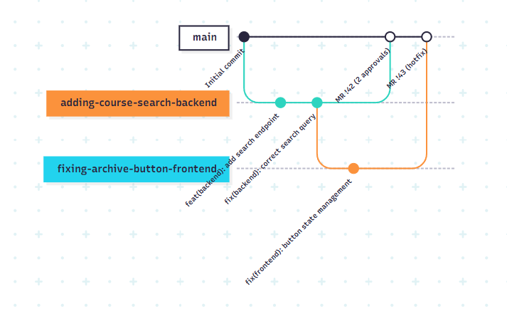
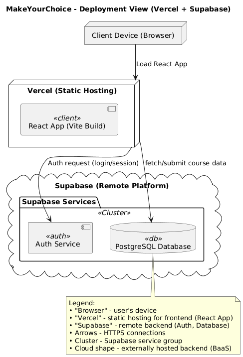

<!-- markdownlint-disable MD033 -->
<!-- Enable Mermaid.js rendering -->

# MakeYourChoice

## Development

### Kanban board

Board link:(https://gitlab.pg.innopolis.university/makeyourchoice-team-17/makeyourchoice/-/boards)

Column entry criteria:

1. Open:
   - Task has been created with clear description
   - Initial time estimate provided (in points/hours)

2. Backend Needed:
   - Task requires backend implementation
   - Frontend requirements (if any) are documented
   - Task has clear acceptance criteria
   
3. Frontend Needed:
   - Task requires frontend implementation
   - Task has clear acceptance criteria
   - Responsiveness requirements specified

4. On the Future:
   - Task is not critical for current milestone
   - Requires external approvals/decisions
   - Has lower priority than current tasks

5. Closed:
   - All acceptance criteria are met
   - Code has been reviewed and approved
   - Passed all automated tests
   - Documentation updated (if required)
   - Merged to main branch

The board has been updated to reflect these criteria, with all existing tasks moved to appropriate columns based on their current state and requirements.

### Git workflow
Base workflow: We use a simplified GitHub Flow adapted for academic projects with feature branching and mandatory code reviews.
Define rules for:
1. Creating issues:
    - All issues must be created from Kanban board columns: Open, Backend Needed, Frontend Needed, On the Future, Closed. Also they should follow user story format.
2. Labelling issue:
   - Sprints: MVP1, MVP2, MVP3, MVP4, MVP5
   - Priority: Critical, High, Normal, Low
   - Team: backend needed, frontend needed
   - Size: small, medium, huge
3. Assigning issues:
   - Team lead assigns issues during sprint planning
4. Branch management:
   1. Naming convention: {short-description-type}
      - adding-course-search-backend - for new features (backend)
      - fixing-archive-button-frontend - for bug fixes (frontend)
   2. Creation: always from main branch
   3. Merging: only via approved Merge Requests
   4. Commit messages:
      - type(scope): description (plus comments optionally)
  5. Code reviews:
 Review of code and documentation before sending to the main branch and approval from the team lead



### Secrets Management

We follow secure practices for handling sensitive information like database credentials and API keys:

#### Storage Location
- All secrets are stored securely in **GitLab CI/CD Variables** (Project Settings → CI/CD → Variables)
- Never committed to version control (`.gitignore` ensures this)
- Accessed only during pipeline execution

#### Secret Types Managed
| Variable Name              | Usage                              |
|---------------------------|------------------------------------|
| `DATABASE_URL`            | Production database connection URL |
| `SUPABASE_ANON_KEY`       | Supabase client access key         |

#### Access Rules
1. **Variable Protection**:
   - Masked in pipeline logs

2. **Environment Separation**:
   ```bash
   # Accessed in .gitlab-ci.yml as:
   - npx supabase gen types typescript --project-id "$SUPABASE_PROJECT_ID" > src/database.types.ts || true
   ```

#### Development Setup
For local development, create a `.env` file:
```ini
# .env.example (template)
DATABASE_URL=your_local_connection_string
SUPABASE_ANON_KEY=your_local_key
```

## Architecture

### Static view


- The components are organized into clear architectural layers, which ensures high cohesion within layers and loose coupling between them.


This improves maintainability in terms of the following characteristics:

- **Modularity**: Each module has a well-defined responsibility.
- **Replaceability**: Components on a page can be rearranged or reused independently without affecting other parts of the system, `hooks` and `api` can be reused or replaced without changing the UI.
- **Testability**: Each layer can be tested in isolation.

### Dynamic view


This sequence diagram illustrates a key scenario in the system: selecting and submitting elective course preferences.

- The user is authorized via the Context and Authorizer.
- Based on the user's role, a request is sent through the DB Connector to retrieve a personalized list of available courses from the Database.
- These courses are then displayed through the Course Form.
- Finally, the user submits their selected course priorities, which are sent back and stored.

This flow involves multiple components across both the frontend and backend layers, including pages, hooks, context, API, and the database.

**Execution time**:  
The complete process, from user authentication through data retrieval and form submission, takes approximately **500–600 ms in total**, measured via separate requests in the browser’s DevTools in a production environment.

This scenario supports the analysis of the following quality attributes:

- **Performance** – responses are received within 0.5–0.6 seconds, meeting user expectations for responsiveness.
- **Reliability** – Supabase consistently returns appropriate status codes (e.g., 200, 201) that confirm successful operations or provide fallback opportunities in case of failure.

### Deployment view



This diagram presents the deployment architecture of the MakeYourChoice system.

- The **frontend** is built with React (Vite) and deployed to **Vercel**, a static hosting platform with CI/CD.
- The **backend** is powered by **Supabase**, a cloud-based Backend-as-a-Service solution that includes:
    - **Auth Service** for login, signup, and role detection
    - **PostgreSQL Database** for storing courses and user preferences

**Deployment choices:**
- Supabase was selected to offload backend logic, avoid maintaining servers, and ensure scalability.
- Vercel enables fast and reliable global delivery of the frontend with simple deployment workflows.

**Customer-side deployment:**
- No backend server or database setup is needed.
- To deploy the system:
    - Clone the frontend repo
    - Connect it to Vercel
    - Set the required environment variables for Supabase:
      ```env
      VITE_SUPABASE_URL=...
      VITE_SUPABASE_ANON_KEY=...
      ```

## Quality

### Reliability

#### Recoverability

**Why it is important**:
- The ability to restore data in case of failures is critical for ensuring the continuity of system operations.
- It is especially important to protect the data about students' elective choices — this information affects the educational process and must be preserved in any situation.

**Risks if not addressed**:
- Loss of data on elective elections.
- Students may have to repeat the selection process, leading to user frustration and additional administrative overhead.

**Test**: [editCourseInfo.test.js](frontend/tests/unit/api/editCourseInfo.test.js)

Scenario (Quality Attribute Scenario format):
- Source: Admin (DoE employee)
- Stimulus: Updates information about the course, such as the title or description
- Environment: During unstable connections or after a database failure
- Artifact: database's data (from Supabase)
- Response: The system checks for the presence of an id, validates the input data, correctly updates information, or reports an error
- Response Measure: Updated data is saved without loss, or an error is thrown, preventing state corruption


#### Fault Tolerance

**Why it is important**:
- The system should remain operational despite minor faults (e.g., temporary network or database issues).  
- Fault tolerance improves system robustness and user trust by minimizing downtime.

**Risks if not addressed**:
- Temporary technical issues could cause service interruptions.  
- Increased burden on technical support and reduced user satisfaction.

**Test**: [archiveCourse.test.js](frontend/tests/unit/api/archiveCourse.test.js)

Scenario (Quality Attribute Scenario format):
- Source: Admin (DoE employee)
- Stimulus: Archives the course (sends it to the archive) to hide it from the student without directly deleting the course
- Environment: During a minor malfunction in Supabase (a partial failure, a temporary request error, or an unexpected exception during a network call)
- Artifact: API function [archiveCourse](frontend/src/api/functions_for_courses.js) and connection to Supabase
- Response: The system intercepts an error or exception, returns and logs the message, preventing the website from crashing
- Response Measure: The error is logged, the interface remains stable, the user receives a clear response
### Performance Efficiency

#### Capacity

**Why it is important**:  
- The system must handle a high volume of requests, particularly during peak periods when 300+ students interact with it simultaneously.  
- High throughput is essential for fast response times and maintaining a positive user experience.

**Risks if not addressed**:  
- Potential for overload during peak usage, which could result in performance degradation or system failure.  
- While exact overload risks are not fully known yet, they are expected to become significant as usage grows.

**Test**: [excelExport.test.tsx](frontend/tests/integration/excelExport.test.tsx)

Scenario (Quality Attribute Scenario format):
- Source: Admin (DoE employee)
- Stimulus: Requests the export of all student priorities data to Excel file
- Environment: During peak load (for example, the last day of elective course selection)
- Artifact: Hook [useExcelExport](frontend/src/hooks/useExcelExport.js) and related UI
- Response: The system requests data from Supabase, generates an Excel file with several sheets, and initiates the download
- Response Measure: Successful export of 1000+ lines in an acceptable time, without errors or interface freezes

## Build and deployment

### Continuous Integration

Our CI pipeline is configured using GitLab CI and consists of several stages that ensure code quality, security, and functionality.

#### CI Workflow File
- [.gitlab-ci.yml](https://gitlab.pg.innopolis.university/makeyourchoice-team-17/makeyourchoice/-/blob/main/.gitlab-ci.yml?ref_type=heads)

#### Tools Used in CI

1. **Docker**:
   - Used to build container images for the application
   - Handles image tagging and pushing to our Harbor registry

2. **ESLint** (via `npm run lint`):
   - Static code analysis for JavaScript/TypeScript
   - Enforces coding standards and identifies potential errors

3. **Jest/Vitest** (via `npm run test:unit` and `npm run test:integration`):
   - JavaScript testing framework for unit and integration tests
   - Verifies component functionality and integration

4. **Trivy**:
   - Container scanning for vulnerabilities (in `container_scanning` job)
   - Filesystem security scanning (in `security_scan` job)
   - Identifies security vulnerabilities in dependencies and container images

5. **Lighthouse** (in `performance-test` job):
   - Performance testing tool
   - Measures web app performance, accessibility, and best practices

6. **Supabase Type Generator**:
   - Generates TypeScript types from Supabase database schema
   - Ensures type safety when interacting with the database

#### CI Workflow Runs
All CI pipeline runs can be viewed in the [GitLab CI/CD Pipelines](https://gitlab.pg.innopolis.university/makeyourchoice-team-17/makeyourchoice/-/pipelines) section.
### Continuous Deployment

We use Vercel for continuous deployment.

- Every push to the main branch triggers a redeployment of the production version.
- Vercel is directly connected to our GitHub repository.
- CI/CD runs and deployments can be managed via the private Vercel dashboard connected to our GitHub repository.


- Live deployment: [https://make-your-choice.vercel.app/](https://make-your-choice.vercel.app/)
