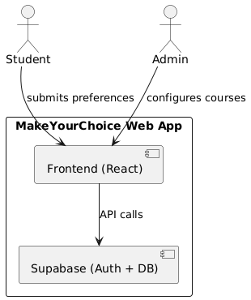

<!-- markdownlint-disable MD033 -->
<!-- Enable Mermaid.js rendering -->

# MakeYourChoice

A simple web app for students to choose and submit elective course preferences, with role-based access for admins.

🌐 [Live App](https://make-your-choice.vercel.app/)  
🎥 [Demo Video](https://drive.google.com/file/d/1MkOZ9z9mcfuEWGdAVP8uHnFERsFKT8gH/view?usp=sharing) <!-- или написать "coming soon" -->

## Table of Contents

- [Project Goals](#project-goals-and-description)
- [Context Diagram](#project-context-diagram)
- [Feature Roadmap](#feature-roadmap)
- [Usage](#usage-instructions)
- [Installation](#installation--deployment-instructions)
- [Documentation](#documentation)


## Project Goal(s) and Description

MakeYourChoice is a lightweight web app designed to help students submit their ranked preferences for elective courses.  
Admins can configure course offerings and monitor student submissions.  
The system supports authentication and role-based behavior, with a responsive UI and Supabase backend.

---

##  Project Context Diagram



This diagram shows how the key stakeholders (students and admins) interact with the application and the Supabase backend.  
The frontend serves as the interface for user interaction, while Supabase handles authentication and data storage.

---

## Feature Roadmap

- [x] Student login via Supabase
- [x] Role-based access (student/admin)
- [x] Course selection and preference form
- [x] Admin course configuration
- [x] Export admin view
- [ ] CSV download for admins
- [ ] Notifications or reminders

---

##  Usage Instructions

1. Visit [the app](https://your-app.vercel.app)
2. Log in using your academic email
3. If you're a student – choose and submit course preferences
4. If you're an admin – view and configure available courses

---

## Installation & Deployment Instructions

More detailed usage description is available by [link](docs/usage/usage_detailed.md)

### To run locally:

```bash
git clone https://github.com/your-org/makeyourchoice.git
cd frontend
npm install
cp .env.example .env # then edit with Supabase URL and anon key
npm run dev
```

### To deploy on Vercel:

1. Push to GitHub
2. Connect the repository to Vercel
3. Add the following environment variables in the Vercel dashboard:

```env
VITE_SUPABASE_URL=https://your-project.supabase.co
VITE_SUPABASE_ANON_KEY=your-anon-key
```
---
## Documentation
- [Development](docs/CONTRIBUTING.md)
- [Quality characteristics and quality attribute scenarios](docs/quality-attributes/quality-attribute-scenarios.md)
- Automated tests
- User acceptance tests
- [Continuous Integration](docs/automation/continuous-integration.md)
- [Architecture](docs/architecture/architecture.md)

## License

This project is licensed under the [MIT License](LICENSE).

