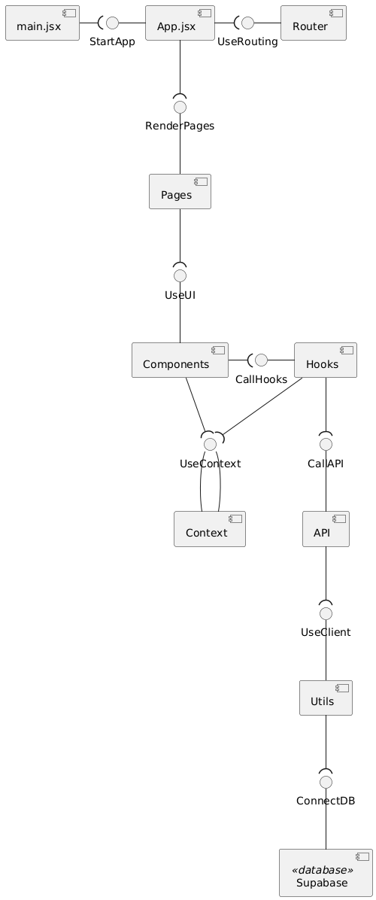
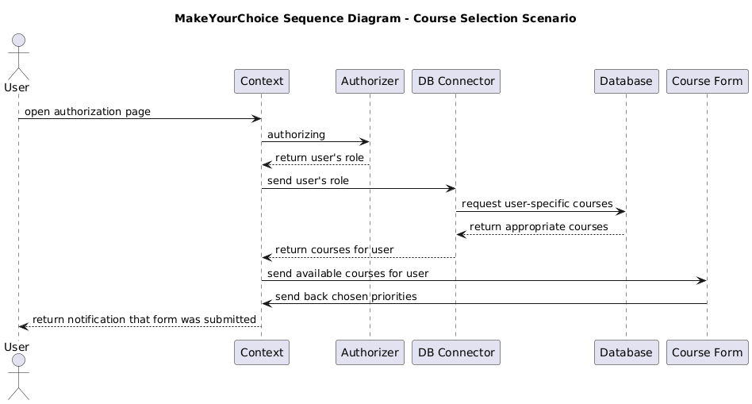

# MakeYourChoice

## Architecture

### Static view

- The components are organized into clear architectural layers, which ensures high cohesion within layers and loose coupling between them.

This improves maintainability in terms of the following characteristics:

- **Modularity**: Each module has a well-defined responsibility.
- **Replaceability**: Components on a page can be rearranged or reused independently without affecting other parts of the system, `hooks` and `api` can be reused or replaced without changing the UI.
- **Testability**: Each layer can be tested in isolation.

### Dynamic view

This sequence diagram illustrates a key scenario in the system: selecting and submitting elective course preferences.

- The user is authorized via the Context and Authorizer.
- Based on the user's role, a request is sent through the DB Connector to retrieve a personalized list of available courses from the Database.
- These courses are then displayed through the Course Form.
- Finally, the user submits their selected course priorities, which are sent back and stored.

This flow involves multiple components across both the frontend and backend layers, including pages, hooks, context, API, and the database.

**Execution time**:  
The complete process, from user authentication through data retrieval and form submission, takes approximately **500–600 ms in total**, measured via separate requests in the browser’s DevTools in a production environment.

This scenario supports the analysis of the following quality attributes:

- **Performance** – responses are received within 0.5–0.6 seconds, meeting user expectations for responsiveness.
- **Reliability** – Supabase consistently returns appropriate status codes (e.g., 200, 201) that confirm successful operations or provide fallback opportunities in case of failure.

