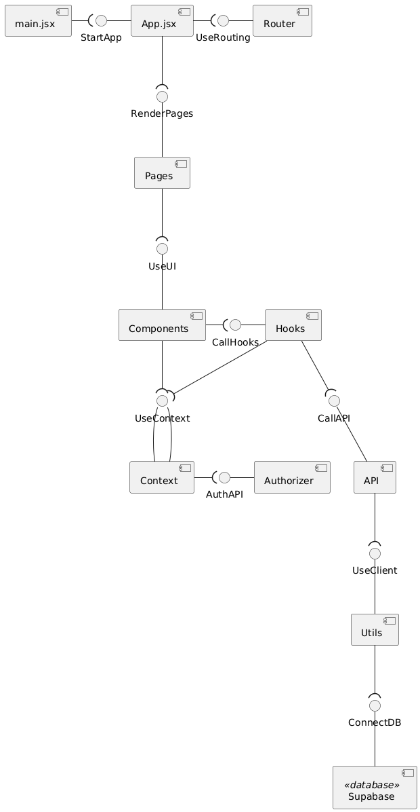

# MakeYourChoice


## Architecture

### Static view



- The components are organized into clear architectural layers, which ensures high cohesion within layers and loose coupling between them.


This improves maintainability in terms of the following characteristics:

- **Modularity**: Each module has a well-defined responsibility.
- **Replaceability**: Components on a page can be rearranged or reused independently without affecting other parts of the system, `hooks` and `api` can be reused or replaced without changing the UI.
- **Testability**: Each layer can be tested in isolation.

### Dynamic view


This sequence diagram illustrates a key scenario in the system: selecting and submitting elective course preferences.

- The user is authorized via the Context and Authorizer.
- Based on the user's role, a request is sent through the DB Connector to retrieve a personalized list of available courses from the Database.
- These courses are then displayed through the Course Form.
- Finally, the user submits their selected course priorities, which are sent back and stored.

This flow involves multiple components across both the frontend and backend layers, including pages, hooks, context, API, and the database.

**Execution time**:  
The complete process, from user authentication through data retrieval and form submission, takes approximately **500–600 ms in total**, measured via separate requests in the browser’s DevTools in a production environment.

This scenario supports the analysis of the following quality attributes:

- **Performance** – responses are received within 0.5–0.6 seconds, meeting user expectations for responsiveness.
- **Reliability** – Supabase consistently returns appropriate status codes (e.g., 200, 201) that confirm successful operations or provide fallback opportunities in case of failure.

### Deployment view


This diagram presents the deployment architecture of the MakeYourChoice system.

- The **frontend** is built with React (Vite) and deployed to **Vercel**, a static hosting platform with CI/CD.
- The **backend** is powered by **Supabase**, a cloud-based Backend-as-a-Service solution that includes:
    - **Auth Service** for login, signup, and role detection
    - **PostgreSQL Database** for storing courses and user preferences

**Deployment choices:**
- Supabase was selected to offload backend logic, avoid maintaining servers, and ensure scalability.
- Vercel enables fast and reliable global delivery of the frontend with simple deployment workflows.

**Customer-side deployment:**
- No backend server or database setup is needed.
- To deploy the system:
    - Clone the frontend repo
    - Connect it to Vercel
    - Set the required environment variables for Supabase:
      ```env
      VITE_SUPABASE_URL=...
      VITE_SUPABASE_ANON_KEY=...
      ```

## Quality

### Reliability

#### Recoverability

**Why it is important**:
- The ability to restore data in case of failures is critical for ensuring the continuity of system operations.
- It is especially important to protect the data about students' elective choices — this information affects the educational process and must be preserved in any situation.

**Risks if not addressed**:
- Loss of data on elective elections.
- Students may have to repeat the selection process, leading to user frustration and additional administrative overhead.

**Test**: [editCourseInfo.test.js](frontend/tests/unit/api/editCourseInfo.test.js)

Scenario (Quality Attribute Scenario format):
- Source: Admin (DoE employee)
- Stimulus: Updates information about the course, such as the title or description
- Environment: During unstable connections or after a database failure
- Artifact: database's data (from Supabase)
- Response: The system checks for the presence of an id, validates the input data, correctly updates information, or reports an error
- Response Measure: Updated data is saved without loss, or an error is thrown, preventing state corruption


#### Fault Tolerance

**Why it is important**:
- The system should remain operational despite minor faults (e.g., temporary network or database issues).  
- Fault tolerance improves system robustness and user trust by minimizing downtime.

**Risks if not addressed**:
- Temporary technical issues could cause service interruptions.  
- Increased burden on technical support and reduced user satisfaction.

**Test**: [archiveCourse.test.js](frontend/tests/unit/api/archiveCourse.test.js)

Scenario (Quality Attribute Scenario format):
- Source: Admin (DoE employee)
- Stimulus: Archives the course (sends it to the archive) to hide it from the student without directly deleting the course
- Environment: During a minor malfunction in Supabase (a partial failure, a temporary request error, or an unexpected exception during a network call)
- Artifact: API function [archiveCourse](frontend/src/api/functions_for_courses.js) and connection to Supabase
- Response: The system intercepts an error or exception, returns and logs the message, preventing the website from crashing
- Response Measure: The error is logged, the interface remains stable, the user receives a clear response
### Performance Efficiency

#### Capacity

**Why it is important**:  
- The system must handle a high volume of requests, particularly during peak periods when 300+ students interact with it simultaneously.  
- High throughput is essential for fast response times and maintaining a positive user experience.

**Risks if not addressed**:  
- Potential for overload during peak usage, which could result in performance degradation or system failure.  
- While exact overload risks are not fully known yet, they are expected to become significant as usage grows.

**Test**: [excelExport.test.tsx](frontend/tests/integration/excelExport.test.tsx)

Scenario (Quality Attribute Scenario format):
- Source: Admin (DoE employee)
- Stimulus: Requests the export of all student priorities data to Excel file
- Environment: During peak load (for example, the last day of elective course selection)
- Artifact: Hook [useExcelExport](frontend/src/hooks/useExcelExport.js) and related UI
- Response: The system requests data from Supabase, generates an Excel file with several sheets, and initiates the download
- Response Measure: Successful export of 1000+ lines in an acceptable time, without errors or interface freezes
