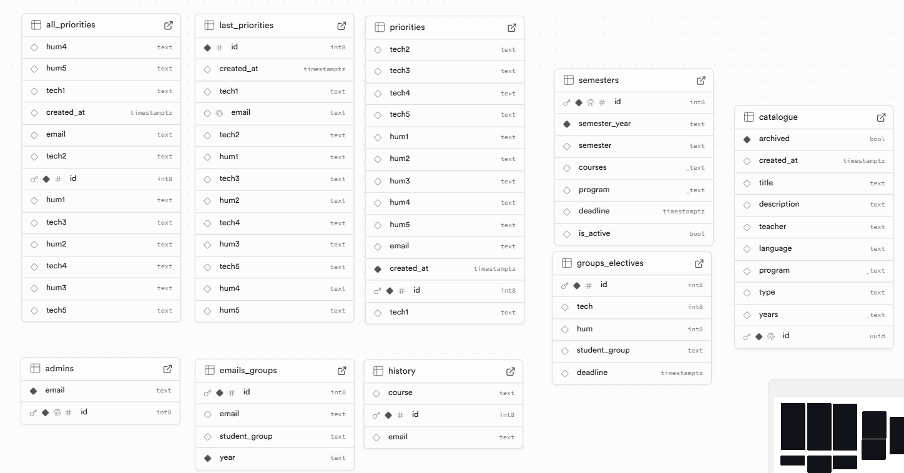

## Detailed Usage Description

### 1. Clone the repository

```
git clone https://gitlab.com/your-username/makeyourchoice.git
cd makeyourchoice
```

### 2. Environment setup
Make sure you have the following installed:

- Node.js (v18+)
- npm

### 3. Setup environment variables
Create a .env file in the frontend/ folder with the following:

```
VITE_SUPABASE_URL=https://your-project.supabase.co
VITE_SUPABASE_ANON_KEY=your-supabase-anon-key
```

### 4. Run the project

```
cd frontend
npm install
npm run dev
```

App will be available at http://localhost:5173 by default.

### 5. Authentication
You can use the following test accounts:

- Student
  Email: t.test@innopolis.university

- Admin
  Email: admin@innopolis.university

### 6. Supabase DB structure


### 7. Common Pages
Route	Description

`/login`	Login screen

`/student-catalogue`	Elective selection for students

`/admin/courses`	Admin view of course catalogue

`/admin/programs`	Admin view of student programs

`/admin/semesters` Admin view of semesters adjustments
